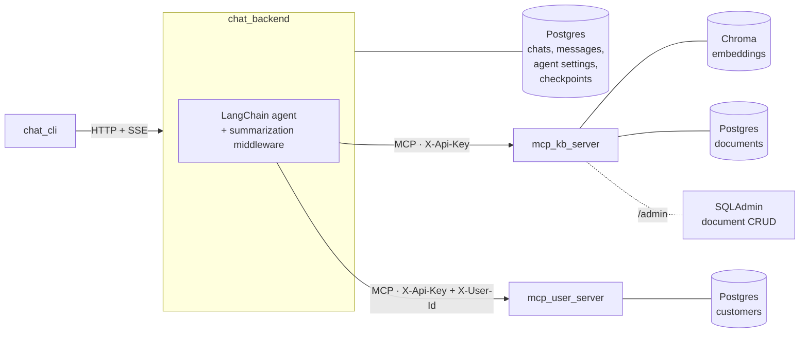

# Tax Support Agent

An LLM customer-support agent for Italian freelancers (Partita IVA holders). It answers tax and invoicing questions grounded in a knowledge base and personalized with the customer's own account data. It is built as separate services connected through MCP.

**Stack:** Python · LangChain / LangGraph · MCP · FastAPI · PostgreSQL · Chroma · OpenAI · Docker Compose

> All knowledge-base content, customer records and the "Acme Tax" brand are synthetic.

## Architecture



| Service | Role |
|---|---|
| [`chat_backend`](chat_backend/) | FastAPI service that runs the agent. Streams responses over SSE and persists chats, messages and agent state, so conversations can be resumed. |
| [`mcp_kb_server`](mcp_kb_server/) | MCP server exposing `search_knowledge_base` over a Chroma vector store. Includes an admin panel where edits re-chunk and re-embed documents. |
| [`mcp_user_server`](mcp_user_server/) | MCP server exposing `get_user_info` for the logged-in customer only. |
| [`chat_cli`](chat_cli/) | Terminal client for starting or resuming a chat. |

## Key design decisions

**The model never chooses whose data it reads.** `get_user_info` takes no arguments. The backend injects the authenticated user's id as an `X-User-Id` header on every MCP call, and the user server filters by that id before running any query. A prompt-injected or hallucinated tool call can't reach another customer's records, because the model has no parameter to set.

**Structure-aware chunking, chosen by measurement.** I started with `docx2txt` and `RecursiveCharacterTextSplitter`, and the chunks cut across sections. Converting `.docx` to Markdown first and splitting on headers (`MarkdownHeaderTextSplitter`) keeps each chunk to one self-contained section. The recall benchmark below confirmed the improvement.

**Agent configuration is data, not code.** System prompt, model and summarization thresholds live in an `AgentSettings` table, and each chat is linked to the configuration it ran with. This sets up per-configuration metrics and A/B comparisons without code changes.

**Bounded context with resumable chats.** LangGraph checkpoints in Postgres let a chat resume from its `thread_id`. `SummarizationMiddleware` compacts history once it passes a configurable token threshold.

**SSE instead of WebSockets.** The client sends a message and the server streams the reply. SSE covers that over plain HTTP. Tool calls and reasoning are filtered out, so only answer tokens reach the client.

## Evaluation

`make eval` runs a synthetic retrieval benchmark ([`test_recall.py`](mcp_kb_server/tests/eval/test_recall.py)):

1. Chunk the knowledge base with the production splitter.
2. Have an LLM generate 3 realistic customer questions per chunk. Questions are cached by chunk-content hash, so re-runs are free until the chunking changes.
3. Query Chroma with each question and report **recall@1**, **recall@5** and **MRR** for the source chunk, plus the worst misses.

Other test suites (`make test`) cover chat persistence and per-user data isolation in the user MCP server. They run against real Postgres via `testcontainers`.

## Quickstart

Requires Docker, [uv](https://docs.astral.sh/uv/) and an OpenAI API key.

```bash
cp .env.example .env            # then set OPENAI_API_KEY
make chat USER_ID=1             # starts the stack and opens a new chat (users 1-4)
make chat USER_ID=1 THREAD_ID=<id>   # resume an existing chat
```

The knowledge-base admin panel is at http://localhost:8002/admin.

| Command | |
|---|---|
| `make up` / `make down` / `make logs` | Manage the Docker Compose stack |
| `make test` | Run all test suites (needs Docker) |
| `make eval` | Run the retrieval benchmark (makes paid OpenAI calls on first run) |

## Limitations and next steps

This is a prototype. Auth is simulated: a cookie carries the user id, and API keys are checked for presence only. The only client is a CLI. Next steps, roughly in priority order:

- End-to-end answer evaluation with LLM-as-judge over a golden question set
- Red-team tests for prompt injection and cross-user data leakage
- Tracing and per-chat cost and latency metrics, tied to `AgentSettings`
- Human-in-the-loop approval for tools that write data
- JWT-based auth between services, and a web chat UI

The full reasoning, including the target architecture, memory and RAG trade-offs, rollout strategy and model hosting, is in [docs/design.md](docs/design.md).
